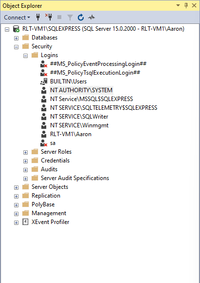
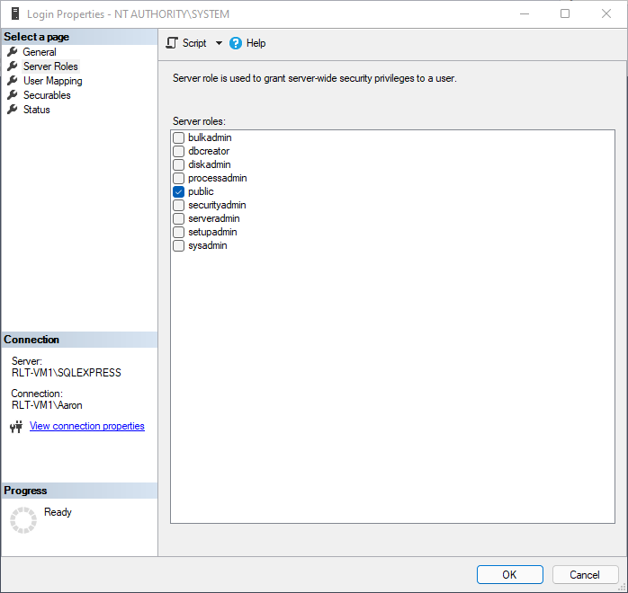
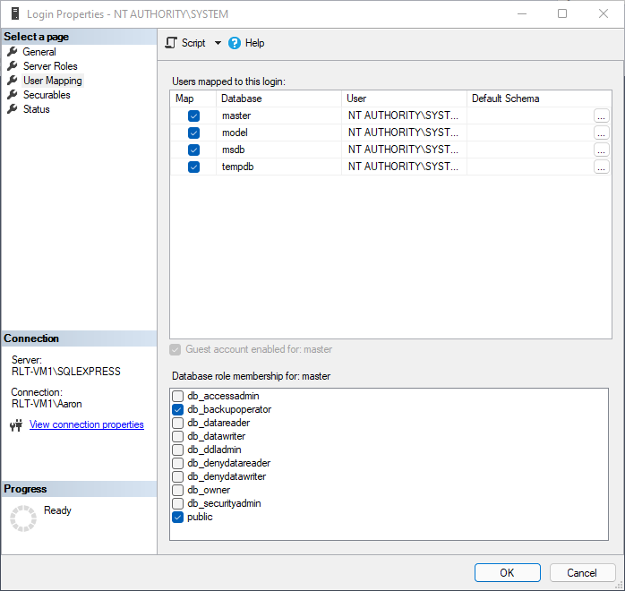

# Backup SQL Databases

## Overview


**Dev Insight:** This script was written to provide SQL backups to clients using [**SQL Express**](https://www.microsoft.com/en-us/sql-server/sql-server-downloads) with a backup solution that doesn't natively support SQL. **It is designed to be used on a schedule in tandem with a file/image based backup solution.**


**Prerequisites:**&#x20;

For this script to run successfully, the user running the script will need to have permission to perform SQL database backups on all databases, including system databases. It is recommended to run the script as `SYSTEM` and set permissions on each database using the process below.



**Granting backup database permissions to `SYSTEM`:**

1. Install & login to **** [**Microsoft SQL Server Management Studio (SSMS)**](https://docs.microsoft.com/en-us/sql/ssms/sql-server-management-studio-ssms?view=sql-server-ver15) **** on the SQL Server
2. Navigate to Server\Instance > Security > Logins
3. Right-click `NT AUTHORITY\SYSTEM` and choose **Properties**
4. Under **Server Roles**, make sure `public` is checked
5. Under **User Mapping**, check each database and select the following database role memberships for each:
   1. `public`
   2. `db_backupoperator`
   3. `db_denydatareader` _(optional)_
   4. `db_denydatawriter`_(optional)_

  

After database permissions are set, you can deploy the script via your RMM.

## Script


**Warning:** Running this script will overwrite existing SQL database backups saved to the default backup location with the name `databasename.bak`.



**Note:** Unless changed manually, the default SQL backup location is `C:\Program Files\Microsoft SQL Server\MSSQL.[INSTANCENAME]\MSSQL\Backup`&#x20;




**Example Output:**

```
Checking for necessary PowerShell modules...
Necessary modules installed.

Databases in localhost\SQLEXPRESS:

Name                 Status           Size Owner   
                                                    
----                 ------           ---- -----   
master               Normal        6.00 MB sa      
model                Normal       16.00 MB sa      
msdb                 Normal      149.56 MB sa      

Performing backup of [master]...
Performing backup of [model]...
Performing backup of [msdb]...

Backup jobs complete.
```

**Example Output with History Switch:**

```
Checking for necessary PowerShell modules...
Necessary modules installed.

Backup history for localhost\SQLEXPRESS (past month):

DatabaseName BackupSetType BackupStartDate      BackupFinishDate     Compressed
                                                                     BackupSize
------------ ------------- ---------------      ----------------     ----------
master            Database 2/1/2022 12:15:26 PM 2/1/2022 12:15:26 PM    3825664
master            Database 2/1/2022 1:11:16 PM  2/1/2022 1:11:16 PM     3821568
master            Database 2/1/2022 1:51:43 PM  2/1/2022 1:51:43 PM     3821568
master            Database 2/1/2022 2:07:29 PM  2/1/2022 2:07:29 PM     3821568
model             Database 2/1/2022 12:15:26 PM 2/1/2022 12:15:26 PM    2578432
model             Database 2/1/2022 1:11:16 PM  2/1/2022 1:11:16 PM     2574336
model             Database 2/1/2022 1:51:43 PM  2/1/2022 1:51:43 PM     2574336
model             Database 2/1/2022 2:07:29 PM  2/1/2022 2:07:29 PM     2574336
msdb              Database 2/1/2022 12:15:27 PM 2/1/2022 12:15:29 PM  126077952
msdb              Database 2/1/2022 1:11:16 PM  2/1/2022 1:11:19 PM   126073856
msdb              Database 2/1/2022 1:51:43 PM  2/1/2022 1:51:48 PM   126073856
msdb              Database 2/1/2022 2:07:29 PM  2/1/2022 2:07:32 PM   126073856

Backups were not performed.
```

## Learn More

Want to learn more about how this script works? Included below are official documentation links for all cmdlets used in this script, as well as other useful documentation where applicable.



**Cmdlet Documentation:**

* [Format-Table](https://docs.microsoft.com/en-us/powershell/module/microsoft.powershell.utility/format-table?view=powershell-7.2)
* [Get-ItemProperty](https://docs.microsoft.com/en-us/powershell/module/microsoft.powershell.management/get-itemproperty?view=powershell-7.2)
* [Get-Module](https://docs.microsoft.com/en-us/powershell/module/microsoft.powershell.core/get-module?view=powershell-7.2)
* [Get-PackageProvider](https://docs.microsoft.com/en-us/powershell/module/packagemanagement/get-packageprovider?view=powershell-7.2)
* [Import-Module](https://docs.microsoft.com/en-us/powershell/module/microsoft.powershell.core/import-module?view=powershell-7.2)
* [Install-Module](https://docs.microsoft.com/en-us/powershell/module/powershellget/install-module?view=powershell-7.2)
* [Install-PackageProvider](https://docs.microsoft.com/en-us/powershell/module/packagemanagement/install-packageprovider?view=powershell-7.2)
* [Set-PSRepository](https://docs.microsoft.com/en-us/powershell/module/powershellget/set-psrepository?view=powershell-7.2)
* [Where-Object](https://docs.microsoft.com/en-us/powershell/module/microsoft.powershell.core/where-object?view=powershell-7.2)
* [Write-Output](https://docs.microsoft.com/en-us/powershell/module/microsoft.powershell.utility/write-output?view=powershell-7.2)
